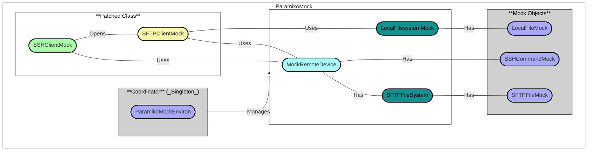

# What is ParamikoMock?

This is a mock library for the Paramiko SSH library. It is intended to be used in unit tests to mock SSH connections and commands.
It supports mocking multiple hosts and multiple commands per host as well as SFTP connections.

## How it works?

ParamikoMock is built to be used with `patch` from the `unittest.mock` module. 
We will cover how to use on the [Usage](usage.md) page.

We use the concept of a `Coordinator` class that manages the mock environment. 
The `Coordinator` is a singleton class that manages the mock environment. It is responsible for creating and managing the mock environment.



Api documentation can be found in the [API Reference](/autoapi/ParamikoMock/) page.
The full implementation can be found in the [GitHub Repository](https://github.com/ghhwer/paramiko-ssh-mock)

## Quick Start

Want to get started quickly? Here is how you can install ParamikoMock:

```bash
pip install paramiko-mock
```

#### Example 1: Mocking SSH Commands

Here is a sample script that demonstrates how to use ParamikoMock for SSH commands:

```python
from ParamikoMock import (
        SSHCommandMock, ParamikoMockEnviron,
        SSHClientMock
)
from unittest.mock import patch
import paramiko

def example_application_function_ssh():
        client = paramiko.SSHClient()
        client.load_system_host_keys()
        client.set_missing_host_key_policy(paramiko.AutoAddPolicy())
        client.connect(
            'myhost.example.ihf', 
            port=22, 
            username='root', 
            password='root', 
            banner_timeout=10
        )
        stdin, stdout, stderr = client.exec_command('ls -l')
        output_1 = stdout.read()
        stdin, stdout, stderr = client.exec_command('docker ps')
        output_2 = stdout.read()
        return output_1, output_2

def test_example_application_function_ssh():
        ParamikoMockEnviron().add_responses_for_host('myhost.example.ihf', 22, {
                're(ls.*)': SSHCommandMock('', 'ls output', ''),
                'docker ps': SSHCommandMock('', 'docker ps output', ''),
        }, 'root', 'root')

        with patch('paramiko.SSHClient', new=SSHClientMock):
                output_1, output_2 = example_application_function_ssh()
                assert output_1 == 'ls output'
                assert output_2 == 'docker ps output'
                ParamikoMockEnviron().assert_command_was_executed('myhost.example.ihf', 22, 'ls -l')
                ParamikoMockEnviron().assert_command_was_executed('myhost.example.ihf', 22, 'docker ps')
        
        ParamikoMockEnviron().cleanup_environment()
```

#### Example 2: Mocking SFTP Operations

Here is a sample script that demonstrates how to use ParamikoMock for SFTP operations:

```python
from ParamikoMock import (
    SSHCommandMock, ParamikoMockEnviron,
    LocalFileMock, SSHClientMock, SFTPFileMock
)
from unittest.mock import patch
import paramiko

def example_application_function_sftp():
        client = paramiko.SSHClient()
        client.load_system_host_keys()
        client.set_missing_host_key_policy(paramiko.AutoAddPolicy())
        client.connect(
            'myhost.example.ihf', 
            port=22, 
            username='root', 
            password='root', 
            banner_timeout=10
        )
        
        sftp = client.open_sftp()
        sftp.get('/remote/path/to/file_b.txt', '/local/path/to/file_b.txt')
        sftp.close()

        sftp = client.open_sftp()
        file = sftp.open('/tmp/afileToWrite.txt', 'w')
        file.write('Some content to write')
        file.close()

        sftp.put('/local/path/to/file_a.txt', '/remote/path/to/file_a.txt')
        sftp.close()

def test_example_application_function_sftp():
        ParamikoMockEnviron().add_responses_for_host('myhost.example.ihf', 22, {}, 'root', 'root')
        
        mock_local_file = LocalFileMock()
        mock_local_file.file_content = 'Local file content'
        ParamikoMockEnviron().add_local_file('/local/path/to/file_a.txt', mock_local_file)

        mock_remote_file = SFTPFileMock()
        mock_remote_file.file_content = 'Remote file content'
        ParamikoMockEnviron().add_mock_file_for_host('myhost.example.ihf', 22, '/remote/path/to/file_b.txt', mock_remote_file)
        
        with patch('paramiko.SSHClient', new=SSHClientMock):
                example_application_function_sftp()
                
                file_on_remote = ParamikoMockEnviron().get_mock_file_for_host('myhost.example.ihf', 22, '/remote/path/to/file_a.txt')
                assert file_on_remote.file_content == 'Local file content'
                
                file_on_local = ParamikoMockEnviron().get_local_file('/local/path/to/file_b.txt')
                assert file_on_local.file_content == 'Remote file content'
                
                file_on_remote = ParamikoMockEnviron().get_mock_file_for_host('myhost.example.ihf', 22, '/tmp/afileToWrite.txt')
                assert file_on_remote.file_content == 'Some content to write'
        
        ParamikoMockEnviron().cleanup_environment()
```

For more examples and detailed usage, please refer to the [Usage](usage) page.